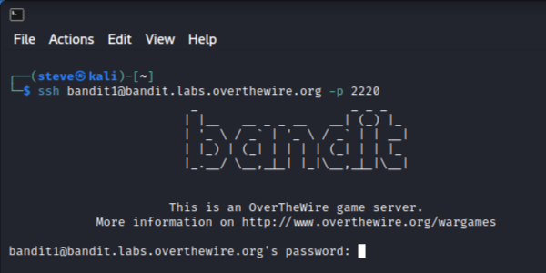
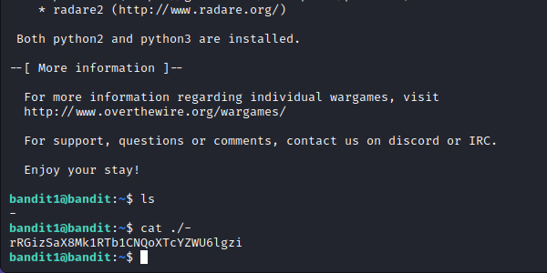
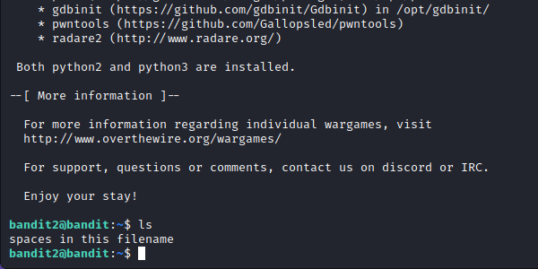
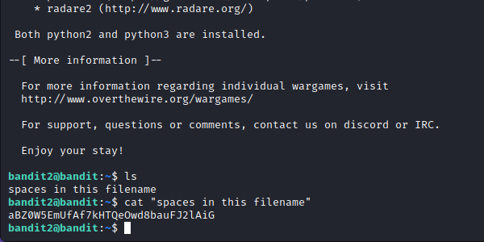
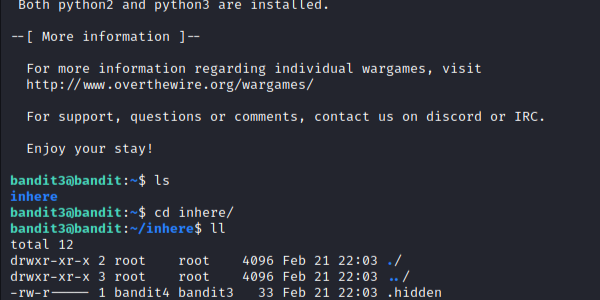
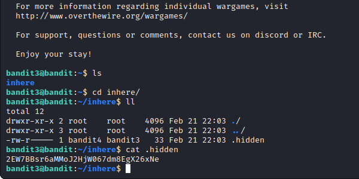
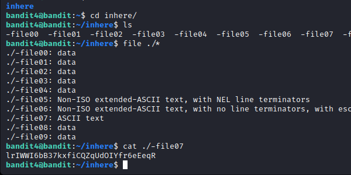

# OverTheWire: Bandit 0→4

OverTheWire is a free, online platform that presents a variety of cybersecurity challenges. Being somewhat new to the field, I thought a writeup/blog would be a great way to document my journey through the website. Hopefully writing this blog will push me to understand why I am performing certain actions and when to perform them. This specific write up will be regarding one of their “Wargames” titled Bandit, which is said to be for absolute beginners.&#x20;

## **Bandit Level 0:**

**Level Goal:** The goal of this level is for you to log into the game using SSH. The host to which you need to connect is bandit.labs.overthewire.org, on port 2220. The username is bandit0 and the password is bandit0. Once logged in, go to the Level 1 page to find out how to beat Level 1.&#x20;

This level seems simple enough, SSH, also known as the Secure Shell, is a network protocol that allows two systems to communicate with each other. To utilize SSH, you type “ssh” into your terminal followed by a command.

To connect to the bandit 0 game, enter this command to your terminal (ssh bandit0@bandit.labs.overthewire.org -p 2220):

<figure><figcaption></figcaption></figure>

This command sends a request through the ssh to log into a remote machine called bandit.labs.overthewire.org, with the specific username “bandit0” additionally, using the –p flag to specify the port number.

From here on, you can enter the password provided by the level.

Upon entering the password, you are flooded with a ton of information regarding the machine, but more importantly, you’ve completed the first level in OverTheWire’s beginner wargame!

<figure><figcaption></figcaption></figure>

## Bandit Level 0 → 1:

**Level Goal:** The password for the next level is stored in a file called readme located in the home directory. Use this password to log into bandit1 using SSH. Whenever you find a password for a level, use SSH (on port 2220) to log into that level and continue the game.

This level requires you to traverse the machine to locate a readme file. To do so, type the “ls” command to list the contents of the directory you are currently in.

<figure><figcaption></figcaption></figure>

Upon entering the command, you can observe the readme file. From there, use the “cat” command followed by the title of the text file you wish to concatenate.


Tip: When specifying the names of files in the command line, you can press “tab” to autocomplete the title specification.


<figure><figcaption></figcaption></figure>

In doing so, you are given the password to the next machine! Make sure to copy this to your clipboard, or anywhere you can access again.

Password:

NH2SXQwcBdpmTEzi3bvBHMM9H66vVXjL

## Bandit Level 1 → 2:

**Level Goal:** The password for the next level is stored in a file called - located in the home directory

This level builds upon the previous ones, first, we will have to log into the bandit1 machine using the following command (ssh bandit1@bandit.labs.overthewire.org -p 2220):

<figure><figcaption></figcaption></figure>

Now copy the password from the previous machine, using ctrl + shift + c, unlike the standard shortcut, to copy a string of text, in the terminal, we include a shift to differentiate the shortcut from “ctrl + c” a terminal command that terminates any running program. Upon copying the password, you will now have to paste it into the password prompt using the ctrl + shift + v shortcut. Having made it into the machine, we must find the “-” file.

Using the ls command, we can see that the file is in the directory we are currently in, but as you notice, in attempting to concatenate (cat) the file, nothing happens. To access files with special characters we will need to utilize the “. /” command which uses an explicit path to the file.

And again, we get the password for the next level.

<figure><figcaption></figcaption></figure>

Password:

rRGizSaX8Mk1RTb1CNQoXTcYZWU6lgzi

## Bandit Level 2 → 3:

**Level Goal:** The password for the next level is stored in a file called spaces in this filename located in the home directory

This level, like the last, asks us to access a file named “spaces in this filename”. Upon logging into the machine and listing its files, the file we need is directly in front of us.

<figure><figcaption></figcaption></figure>

To cat this file, we will need to put the full name of the file in quotes like so:

<figure><figcaption></figcaption></figure>

And we are given the password for the next level!

Password:

aBZ0W5EmUfAf7kHTQeOwd8bauFJ2lAiG

## Bandit Level 3 → 4:

Level Goal: The password for the next level is stored in a hidden file in the “inhere” directory.

Similar to the last, this level asks us to find a hidden file. This is easy, cd into the “inhere” directory and use the “ls” command to list the files within the directory. Additionally, use the "file ./\*" command to search and display the files and file types in the directory.

<figure><figcaption></figcaption></figure>

Now that we have revealed the hidden directory, we can cat the file with the following command:

<figure><figcaption></figcaption></figure>
