# OverTheWire: Bandit 10→14

## Bandit Level 10 → 11:

**Level Goal:** The password for the next level is stored in the file data.txt, which contains base64 encoded data

This level seems to ask us to decode the base64 encoded data stored in the text file. Upon concatenating the text file, we are met with this string…

<figure>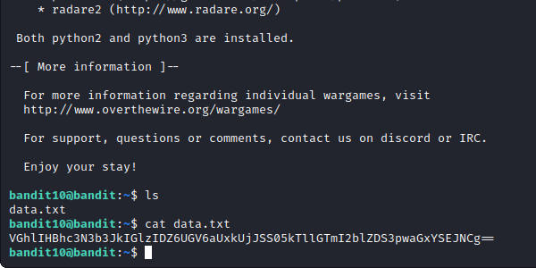<figcaption></figcaption></figure>

As stated in the level goal, the contents of the text file are encoded. After a quick Google search, I found out that we can encode or decode standard input/output or any file content using Linux's base64 encoding and decoding system.

Using the command “base64 -d data.txt” (-d for decode) we get the following output:

<figure>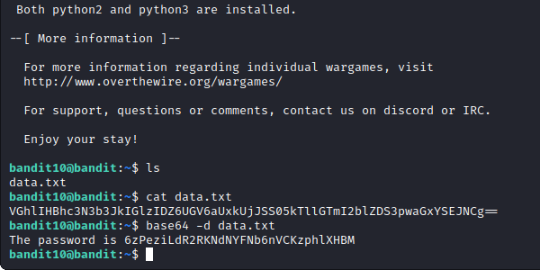<figcaption></figcaption></figure>

We have obtained the next level’s password through decoding!

Password:

6zPeziLdR2RKNdNYFNb6nVCKzphlXHBM

## Bandit Level 11 → 12:

**Level Goal:** The password for the next level is stored in the file data.txt, where all lowercase (a-z) and uppercase (A-Z) letters have been rotated by 13 positions

This level also takes a bit of decoding, the letters are encoded in ROT13, a letter substitution cipher that replaces a given letter with one that follows 13 places after it.

Upon concatenating the data text file, we are shown this:

<figure>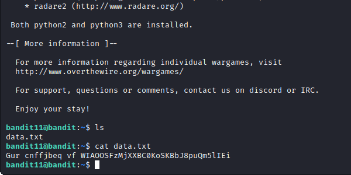<figcaption></figcaption></figure>

Using the tr command, a tool that translates, deletes, and squeezes characters from the standard input, we can decode this.

Knowing that the letters are encoded in ROT13, we can use this command, “cat data.txt | tr a-zA-Z n-za-zN-ZA-M”. This may look complicated at first, but observe tr’s standard format,&#x20;

tr \[SET1] \[SET2], In this case, tr will replace the characters within the first set with the corresponding characters from the second set.

“a-zA-Z” represents our first set, including lowercase and uppercase letters. There are the letters that will be replaced.&#x20;

“n-za-zN-ZA-M” represents our second set, the letters that will take the place of our first set. This set starts 13 letters after a, and because the translation won’t go further than z, we start it again at a-m. Again, also including the uppercase counterparts.

With this, we are given the password to the next level.

<figure>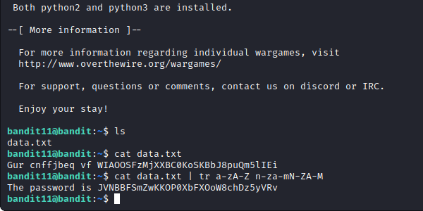<figcaption></figcaption></figure>

Password:

JVNBBFSmZwKKOP0XbFXOoW8chDz5yVRv

## Bandit Level 12 → 13:

**Level Goal:** The password for the next level is stored in the file data.txt, which is a hexdump of a file that has been repeatedly compressed. For this level it may be useful to create a directory under /tmp in which you can work using mkdir. For example: mkdir /tmp/myname123. Then copy the datafile using cp, and rename it using mv (read the manpages!)

This level asks us to uncover the password in this hexdump. According to Wikipedia, a hexdump is a hexadecimal view of computer data, in a hex dump, each byte (8 bits) is represented as a two-digit hexadecimal number. This is evident when we cat the data.txt file.

<figure>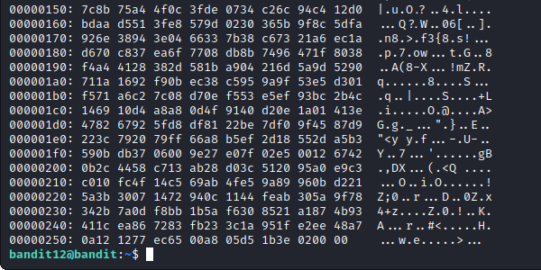<figcaption></figcaption></figure>

For the purposes of this level, we will need both read and write privileges so, as the level goal suggests we create our own working directory within the /tmp or temporary directory. Use the command, “mkdir /tmp/(anyname)” to create our own working directory. The make directory command will create a directory in the specified location with our specified title.

Next, we copy the data.txt file by using the copy command “cp data.txt /tmp/swift”, where data.txt is the file we wish to copy and /tmp/swift the directory where we wish to copy it to. Lastly, cd to the directory we created with “cd /tmp/swift”, confirm that we have copied the file with the ls command.

<figure>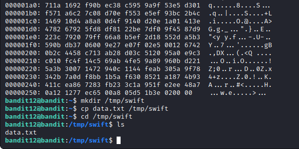<figcaption></figcaption></figure>

In observing the list of possible commands given, the xxd command-line tool would be great for this scenario. The xxd tool allows us to create a hexdump or do the reverse. Using the command “xxd -r data.txt > data1”, we revert (-r) the text file and output to a file called “data1”. Now use the command “file data1” to confirm its filetype. The command tells us the file is currently in a gzip compressed data format, so we must decompress the file with gzip. But before we can utilize gzip, we must change the file format to a gzip file.  We can do this with the move command, “mv data1 data2.gz”. Now, we can use the command “gzip -d data2.gz” to decompress (-d) data2. Using the file command, “file data2”, to once again, check the file’s type, we see it is now in bzip2 compressed data format.&#x20;

<figure>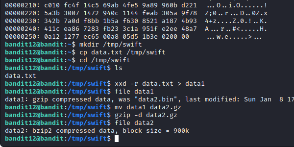<figcaption></figcaption></figure>

Now we must change the file extension to match that of bzip2, using the command “mv data2 data3.bz2”, we can then utilize bzip2 to decompress the file once more with “bzip2 -d data3.bz2”. Checking the newest file’s type with the file command (“file data3”), we see it is again in a gzip compressed data format.&#x20;

<figure><figcaption></figcaption></figure>

We must change data3’s filetype to gzip, “mv data3 data4.gz'' so now we can use gzip to decompress. “gzip -d data4.gz” to check the filetype once more with “file data4” we see that it is now a tar archive.&#x20;

<figure>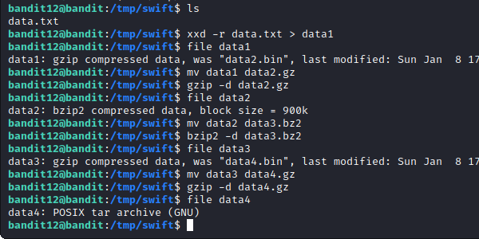<figcaption></figcaption></figure>

We change the new file’s extension to a tar with the command, “mv data4 data5.tar”, we can now interact with the tar file using tar. With the command, “tar xf data5.tar” (xf for extract file) we get a bin file called data5.bin. Checking the bin’s filetype with “file data5.bin” we are once again in tar. We move the data5 to a tar format by using the command, “mv data5.bin data6.tar” Using tar with “tar xf data6.tar” we are given a file called data6.bin, in checking its filetype with “file data6.tar” we see it is once again a bzip2 compressed data file.&#x20;

<figure>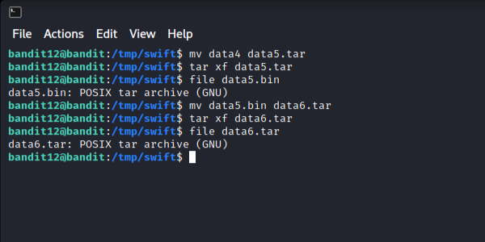<figcaption></figcaption></figure>

Move the data6 file with the command, “mv data6.bin data7.bz2”, and decompress again using “bzip2 -d data7.bz2”. Now, to check data7’s filetype we use “file data7'' to see that it is in the tar archive format. We must move the file again, the command “mv data7 data8.tar” we can now use the tar command, “tar xf data8.tar” which will give us a data8.bin file.

<figure>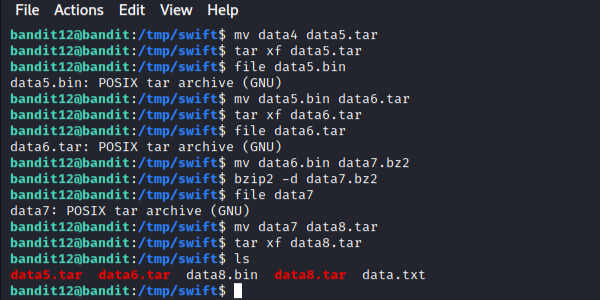<figcaption></figcaption></figure>

We can check the filetype of data8.bin with “file data8.bin'' we see it’s a gzip file once again. We move the data8 file with “mv data8.bin data9.gz”. So we can now use gzip to decompress with “gzip -d data9.gz”. Checking the filetype of data9 (file data9), we see it is finally in ASCII text. We can now cat the file to obtain the next level’s password.

<figure>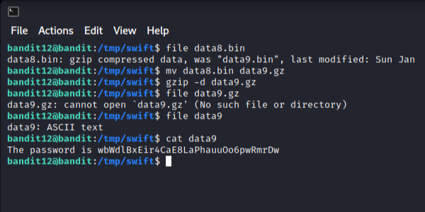<figcaption></figcaption></figure>

Password:

wbWdlBxEir4CaE8LaPhauuOo6pwRmrDw

## Bandit Level 13 → 14:

**Level Goal:** The password for the next level is stored in /etc/bandit\_pass/bandit14 and can only be read by user bandit14. For this level, you don’t get the next password, but you get a private SSH key that can be used to log into the next level. Note: localhost is a hostname that refers to the machine you are working on

This level requires us to find a password that is stored in the badit14 machine.

In typing the ls command, we see that the ssh key, “sshkey.private” is in our working directory. We utilize this key within our ssh command, like so, “ssh bandit14@localhost -i sshkey.private -p 2220”. Localhost is stated here as we are connecting to the machine through our own localhost, additionally, we use the -i flag to specify a file containing the private key we need to enter.

<figure>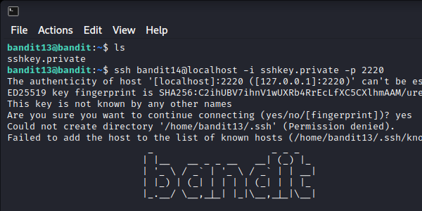<figcaption></figcaption></figure>

When inside the machine, we can then cat the file with its specified path from the level goal. Use the command, “cat /etc/bandit\_pass/bandit14” to get the password for the next level.

<figure>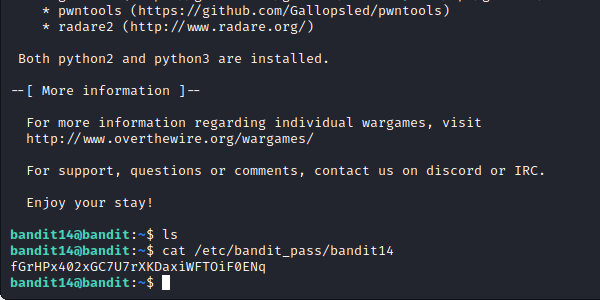<figcaption></figcaption></figure>


Note: If you do wish to continue from here, stay on the bandit14 machine as that is how you will access the next level.


Password:

fGrHPx402xGC7U7rXKDaxiWFTOiF0ENq

## Bandit Level 14 → 15:

Level Goal: The password for the next level can be retrieved by submitting the password of the current level to port 30000 on localhost.

Here the level requires us to retrieve the next level’s password by submitting the password of the current level to port 30000 on localhost (our machine).

To do this, we use a very useful networking command-line tool called Netcat (nc). Using the command “nc localhost 30000”, which is pretty silent, we get a new line within our terminal.

The prompt is waiting for us to input the password we had just obtained, we can copy the password (ctrl + shift + c) and paste it (ctrl + shift + v) into the new line. This should give you the password for our next level.

<figure>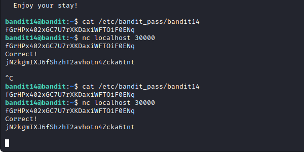<figcaption></figcaption></figure>

Password:

jN2kgmIXJ6fShzhT2avhotn4Zcka6tnt

