# OverTheWire: Bandit 25->29

## Bandit Level 25 → 26:

**Level Goal:** Logging in to bandit26 from bandit25 should be fairly easy… The shell for user bandit26 is not **/bin/bash**, but something else. Find out what it is, how it works and how to break out of it.

Listing the files of the home directory of bandit25 shows us a file called "bandit26.sshkey". Lets try sshing into bandit26 with this key. Type the command "ssh bandit26@localhost -p 2220 -i bandit26.sshkey". Upon making the ssh request, it looks like we are initially logged in but our connection to localhost eventually closes.

<figure>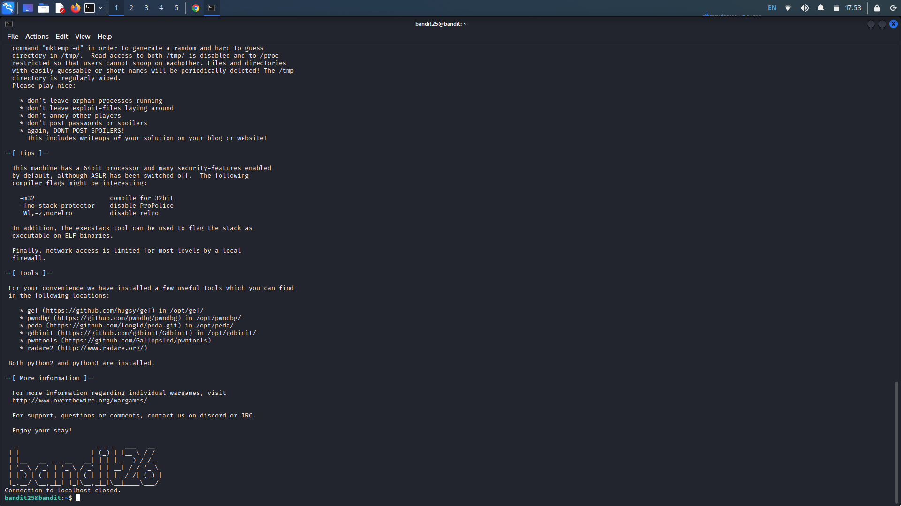<figcaption></figcaption></figure>

Observing the level goal, it states the user bandit26 is not /bin/bash. Lets check what shell bandit26 is running with the command "cat /etc/passwd | grep bandit26". The "/home/bandit26:/usr/bin/showtext indicates the default shell the machine is running, in this case "showtext". Lets cat this file, with "cat /usr/bin/showtext".

<figure>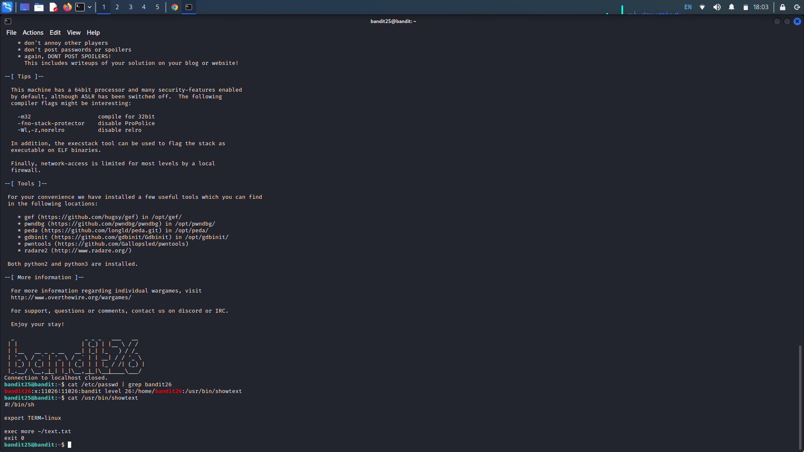<figcaption></figcaption></figure>

The shell script, showtext first sets the terminal name to "linux" then opens the "text.txt" file using "more" then exits. The more command is a way to read text files one page at a time. It looks like if we stop the exit condition from occuring, we can stay in the more window and proceed from there. Re-run the ssh command with your terminal extremely short.

<figure>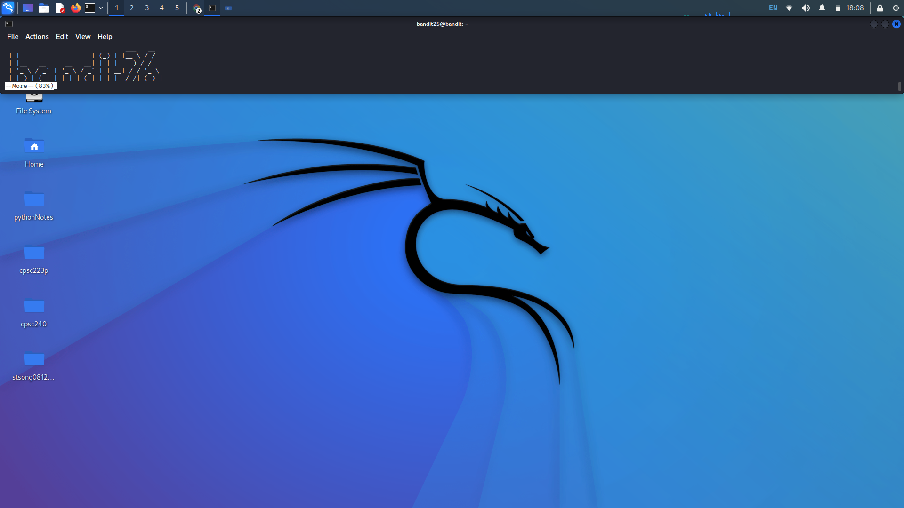<figcaption></figcaption></figure>

Confirmed by the --More-- tag at the bottom of our terminal, we are still in the more window. From here, we can use "vim" to execute command-line prompts. Press "v" to initialize vim, then we can enter the command ":e /etc/bandit\_pass/bandit26" to read the bandit26 password.


If you are continuing from bandit25 to bandit26, stay in the vim window.


<figure>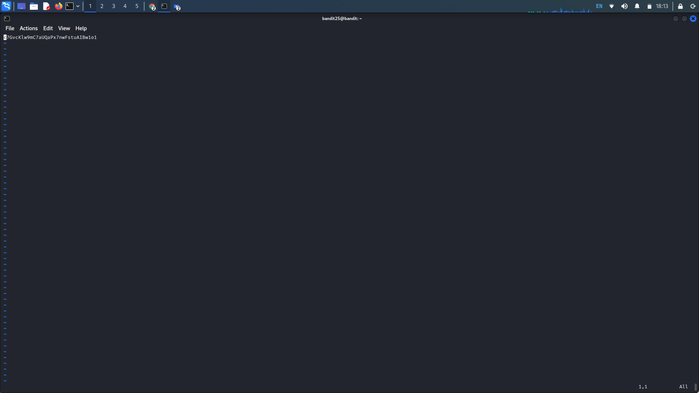<figcaption></figcaption></figure>

Password:

c7GvcKlw9mC7aUQaPx7nwFstuAIBw1o1

## Bandit Level 26 → 27:

**Level Goal:** Good job getting a shell! Now hurry and grab the password for bandit27!

If you are establishing a new ssh connection, make sure your terminal window is very short so it stays in the "more" window. Again, press "v" to open vim.

From here, we can use the command, ":set shell=/bin/sh" to set the bandit26 shell to a bash shell. Additionally, run the ":!command" command so we can start prompting commands to the shell. With this let try ":!ls" to view the files in the home directory.&#x20;

<figure>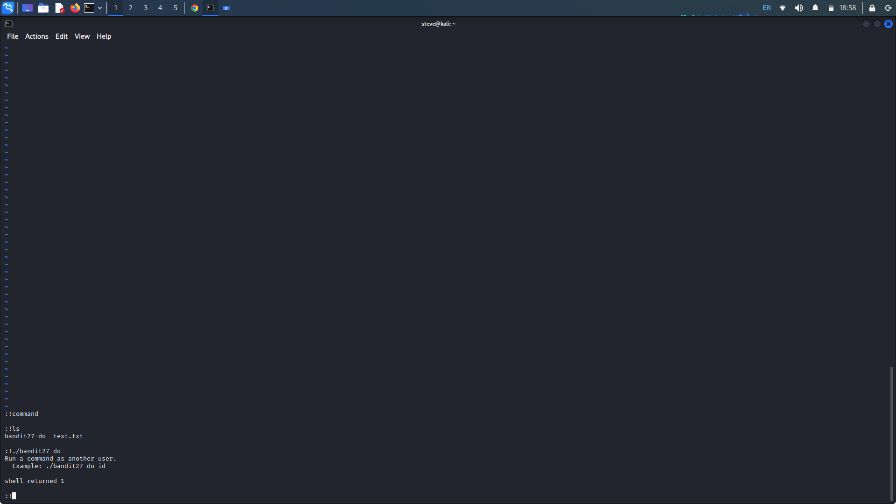<figcaption></figcaption></figure>

Lets try running the bandit27-do executable. Use the command ":!./bandit27-do" to see what the executable does. From the output it looks like we can run commands with this script with higher privileges. This time, execute the script with the command "cat /etc/bandit\_pass/bandit27" to cat the password.

<figure><figcaption></figcaption></figure>

Password:

YnQpBuifNMas1hcUFk70ZmqkhUU2EuaS

## Bandit Level 27 → 28:

**Level Goal:** There is a git repository at ssh://bandit27-git@localhost/home/bandit27-git/repo via the port 2220. The password for the user bandit27-git is the same as for the user bandit27. Clone the repository and find the password for the next level.

From the level goal, it looks like we need to clone the repository at the given location. Lets create a working directory in our temp folder with "mkdir /tmp/name".&#x20;

<figure>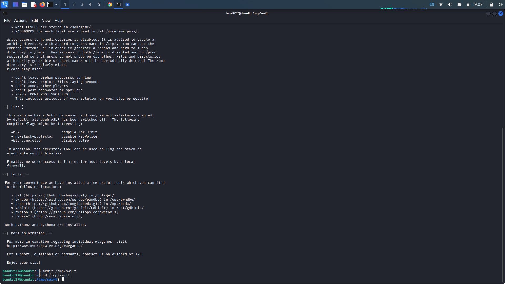<figcaption></figcaption></figure>

In our temp folder, clone the repository at the provided path with "git clone (path)" including our port, :"2220" after localhost. Enter the password and the repository is successfully cloned. In the repository is a README file, cat the file and we are given the flag.

<figure>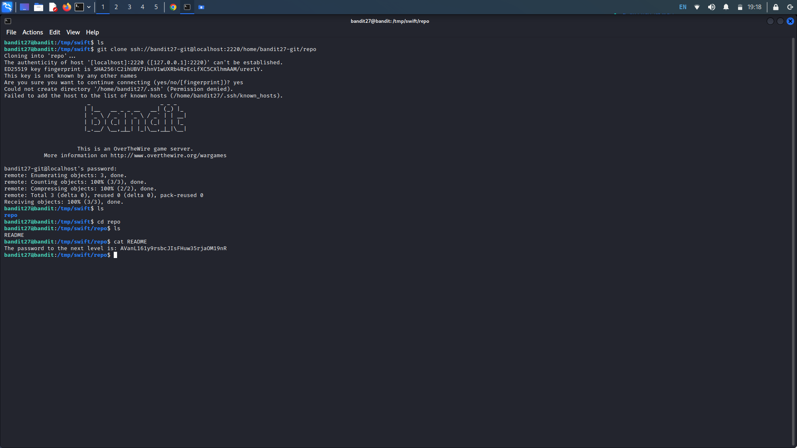<figcaption></figcaption></figure>

Password:

AVanL161y9rsbcJIsFHuw35rjaOM19nR

## Bandit Level 28 -> 29:

**Level Goal:** There is a git repository at `ssh://bandit28-git@localhost/home/bandit28-git/repo` via the port `2220`. The password for the user `bandit28-git` is the same as for the user `bandit28`.

Clone the repository and find the password for the next level.

Like in our last challenge, we need to clone the git repository at the provided path. Create a temp folder where we will clone the repository.

<figure>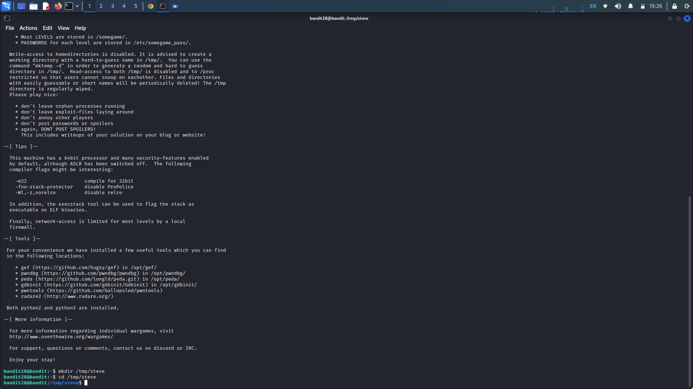<figcaption></figcaption></figure>

Now clone the repository with "git clone (path)" remembering to include the correct port (":2220") after "localhost". Enter the password and the repository is successfully cloned into our working directory.

<figure>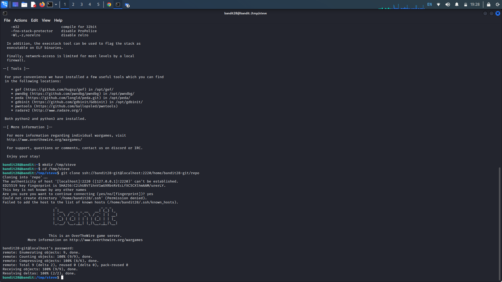<figcaption></figcaption></figure>

In our repository folder, we see a README.md file. Cat the file and we get some notes regarding bandit29. Specifically, we get the username and hidden password for bandit29. Use the "git log" command to view past "commits" (saves) of the repository. Here we see the author has already commit a "fix info leak". We can view the changes made with the command "git log -p -1". "-p" to display the changes made to the files in each commit, and "-1"  to only outputs the latest commit.

<figure>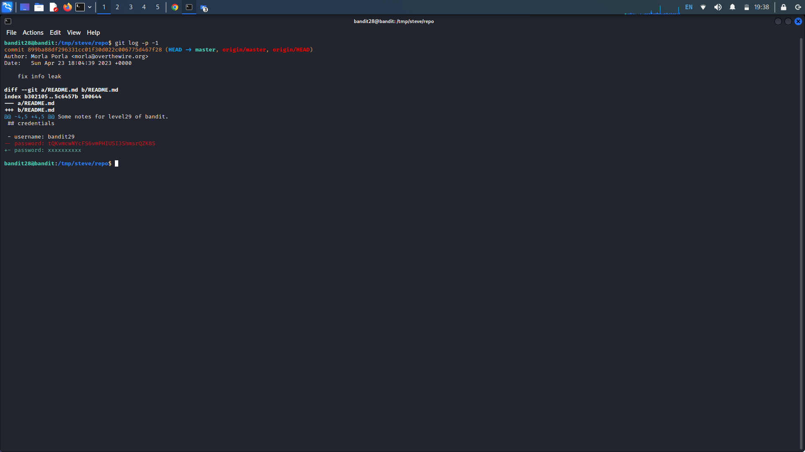<figcaption></figcaption></figure>

This gives us bandit30's password.

Password:

tQKvmcwNYcFS6vmPHIUSI3ShmsrQZK8S

## Bandit Level 29 -> 30:

**Level Goal:** There is a git repository at `ssh://bandit29-git@localhost/home/bandit29-git/repo` via the port `2220`. The password for the user `bandit29-git` is the same as for the user `bandit29`.

Clone the repository and find the password for the next level.

Again, create or navigate to a working directory in /tmp/. Lets clone the repository with the given path. "git clone (path)" specifying the port. Upon successful cloning, we navigate to the README.md file. Upon concatenating the file, we get the username but no password.

<figure>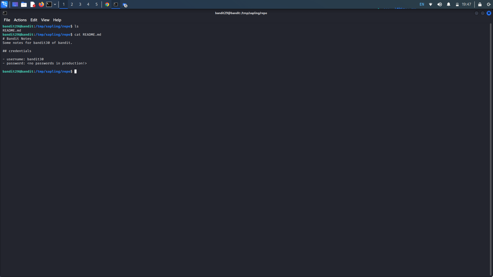<figcaption></figcaption></figure>

Lets try checking the logs with "git log" we don't see much, only the initial commit and a fix to the username. We can try checking the changes made in case the commit messages are incorrect. Try "git log -p". Unluckily we don't see much from the logs.

<figure>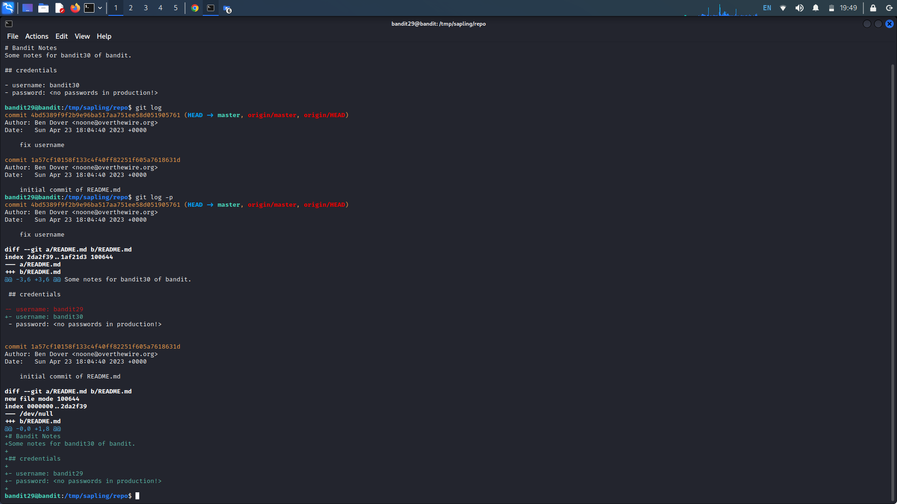<figcaption></figcaption></figure>

Lets try looking around some more, use "git branch" to view the different branches of the repository. Git branches allows the author to develop features, fix bugs, or safely experiment with new ideas in a contained area of the repository. Use the command "git branch -r" to list the remote branches instead of just the local ones. We see more branches, select the /dev branch with command "git checkout dev". Now we can check the changes made with git log -p and we see the password in the latest change.

<figure>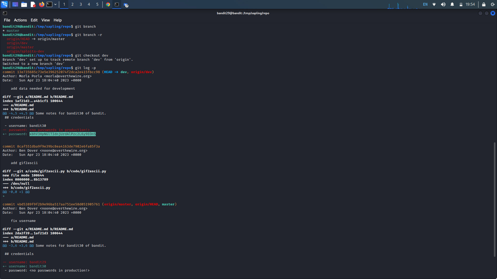<figcaption></figcaption></figure>

Password:

xbhV3HpNGlTIdnjUrdAlPzc2L6y9EOnS

