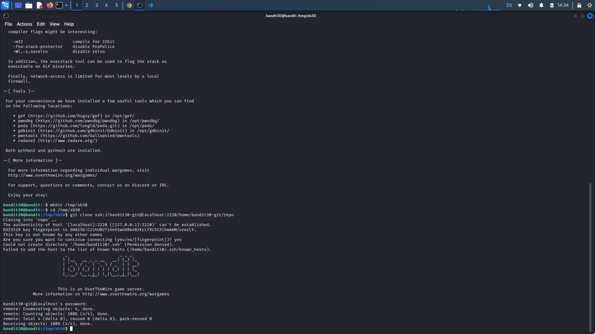
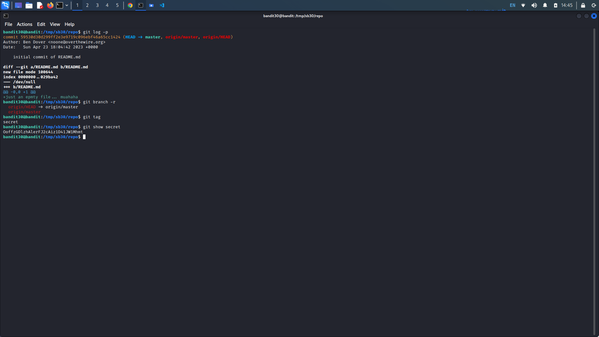
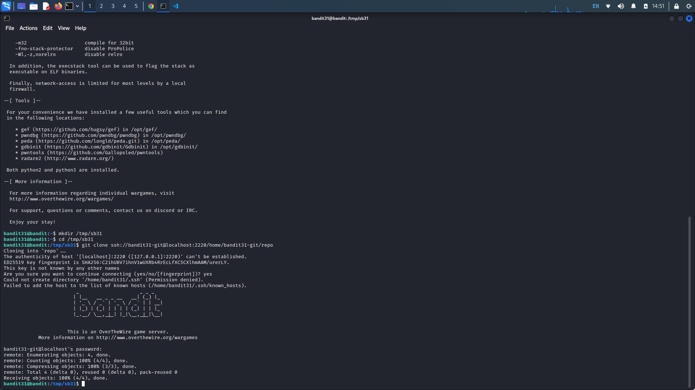
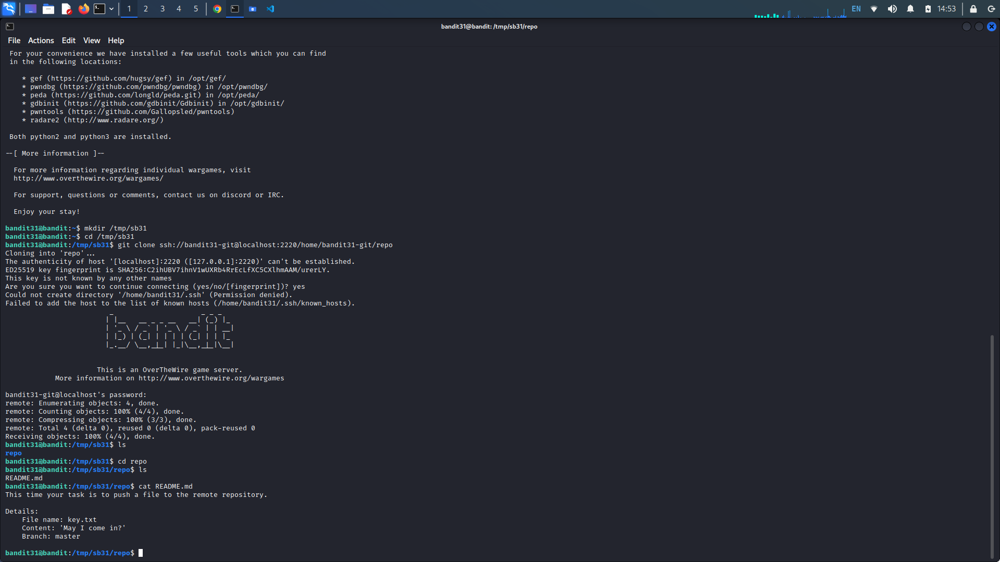
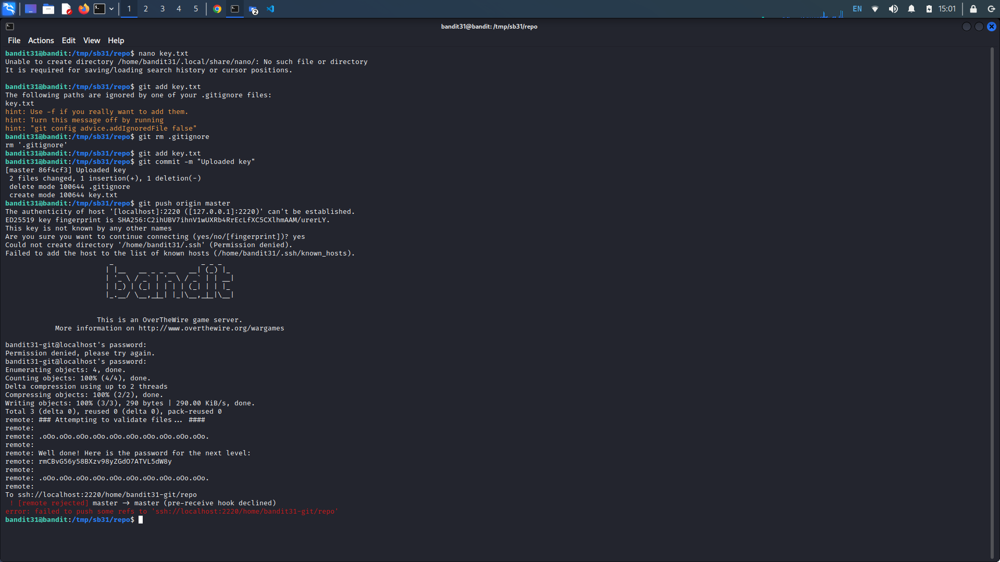
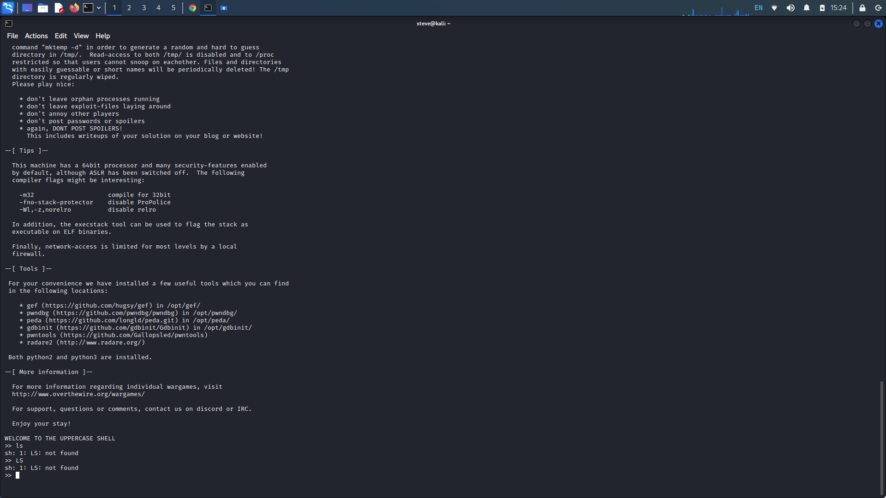
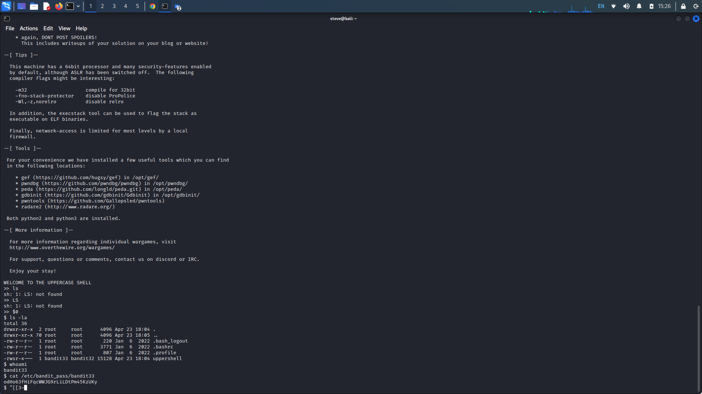

# OverTheWire: Bandit 30->33

## Bandit Level 30 → 31:

**Level Goal:** There is a git repository at `ssh://bandit30-git@localhost/home/bandit30-git/repo` via the port `2220`. The password for the user `bandit30-git` is the same as for the user `bandit30`.

Clone the repository and find the password for the next level.

Clone the repository in our temp working directory, remembering to include the port after localhost.

<figure><figcaption></figcaption></figure>

Concatenating the readme file in the repository, we get an empty file. Attempting git log and git branch doesn't seem to give us any important information. Looking at some more [git commands](https://git-scm.com/docs), git tag will tag specific points in a repository's history. We see there is a tag called "secret", we can read the tag with "git show secret". We are given the password.

<figure><figcaption></figcaption></figure>

Password:

OoffzGDlzhAlerFJ2cAiz1D41JW1Mhmt

## Bandit Level 31 → 32:

**Description:** There is a git repository at `ssh://bandit31-git@localhost/home/bandit31-git/repo` via the port `2220`. The password for the user `bandit31-git` is the same as for the user `bandit31`.

Clone the repository and find the password for the next level.

Again, clone the git repository on port 2220.&#x20;

<figure><figcaption></figcaption></figure>

Concatenating the readme file tells us to push a key.txt file to the master branch of the remote repository.

<figure><figcaption></figcaption></figure>

First lets create our key.txt file. Create the text file with the specified content asking, "May I come in?". Attempting to add the file to the repository with "git add key.txt" tells us out .gitignore file is ignoring it. We can remove the .gitignore file and try adding it again. Now commit the file with "git commit -m "Uploaded key" saving the file with the provided message. Now push the changes to the master branch with "git push origin master". Upon entering the level's password, we are given the flag.

<figure><figcaption></figcaption></figure>

Password:

rmCBvG56y58BXzv98yZGdO7ATVL5dW8y

## Bandit Level 32 → 33:

**Level Goal:** After all this `git` stuff its time for another escape. Good luck!

It looks like the shell on this machine automatically converts our prompts to uppercase.&#x20;

<figure><figcaption></figcaption></figure>

Executing the variable "$0" resets us to the machine's default shell, in this case, it takes us out of interactive mode to the "sh" shell. From here we can execute normal shell commands. Running "ls -la" shows us that the bandit33 machine has special privileges. Typing "whoami" shows us that we are indeed bandit33 therefore we can cat the password.

<figure><figcaption></figcaption></figure>

Password:

odHo63fHiFqcWWJG9rLiLDtPm45KzUKy

## Bandit Level 33 → 34:

**------------------------------------------DNE-----------------------------------------------------**
