# OverTheWire: Bandit 5→9

## Bandit Level 5 → 6:

**Level Goal:** The password for the next level is stored in a file somewhere under the inhere directory and has all of the following properties: human-readable, 1033 bytes in size, and not executable

After traversing into the working directory, we are met with 20 directories with different files inside them. Upon using the “ll” command, we aren’t shown any useful information pertaining to the level.

<figure>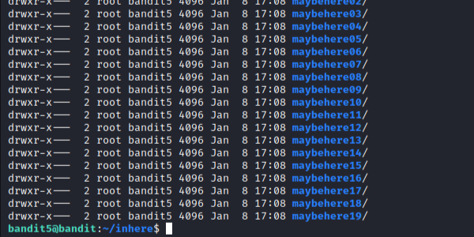<figcaption></figcaption></figure>

I bet we need to use the find command, this command will let us locate a file using different flags that will act as a filter. Upon further research I found that we could search files by size using a -size flag.

In utilizing the command “find . -size 1033c”&#x20;

* “.” to look inside current directory&#x20;
* “-size” to search by size&#x20;
* “1033” size to search by&#x20;
* “c” type of unit, in this case, bytes&#x20;

We are given the following output...

<figure>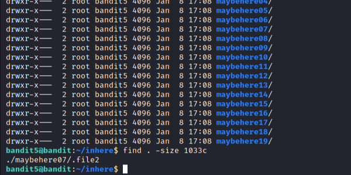<figcaption></figcaption></figure>

From here, we can traverse into the maybehere07 folder and cat the file2 folder with the command “cat ./.file2” which will give us the next password.

<figure>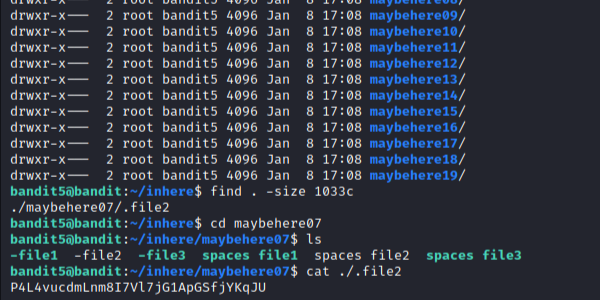<figcaption></figcaption></figure>

Password:

P4L4vucdmLnm8I7Vl7jG1ApGSfjYKqJU

## Bandit Level 6 → 7:

**Level Goal:** The password for the next level is stored somewhere on the server and has all of the following properties: owned by user bandit7, owned by group bandit6, and 33 bytes in size

Logging into the bandit6 level, we are not met with any working directory. Since the goal asks us to find a text file with certain properties, we can assume we need to use the find command.

<figure>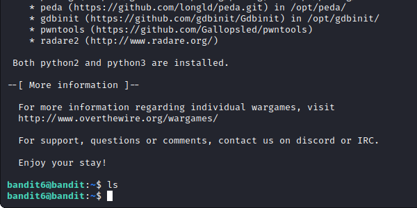<figcaption></figcaption></figure>

Similar to the last file, we can use the command “find / -user bandit7 –group bandit6 –size 33c”. This time, we are using the “/” flag to search through the entire system as we are not given a working directory. Additionally, we are using the user and group flags to specify what user and group the file is under.

<figure>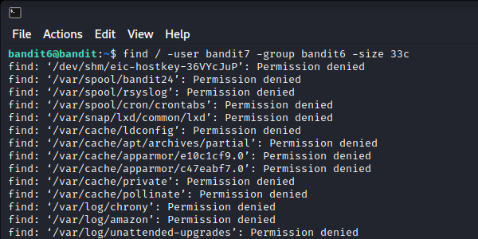<figcaption></figcaption></figure>

Upon entering the command we are shown a wave of results, mostly saying “Permission denied” except for one file which has the path below.

This will be our password file, we can cat the file entering the same path that we see, “cat /var/lib/dpkg/info/bandit7.password” which will then give you the password for the next level.

<figure>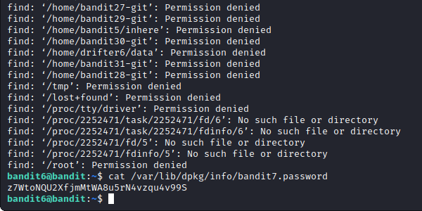<figcaption></figcaption></figure>

Password:

z7WtoNQU2XfjmMtWA8u5rN4vzqu4v99S

## Bandit Level 7 → 8:

**Level Goal:** The password for the next level is stored in the file data.txt next to the word millionth

For this level, we are told the password is located in a file called “data.txt” next to the word “millionth”. Upon listing the items within our current directory, we are met with the data.txt file. In attempting to cat that file, you will be met with a barrage of words and strings, certainly too many to sort through by eye.

<figure>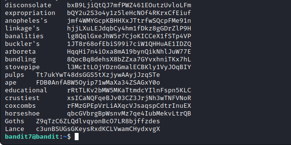<figcaption></figcaption></figure>

This is where we will utilize the grep command. Grep (Global Regular Expression Print) is a command-line tool used to search for a string of characters in a specified file.

Using the command “grep millionth data.txt”, where millionth is the word we want to find and where data.txt is the file we wish to search, we are given the password to the next level.

<figure>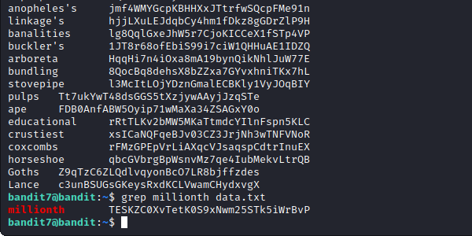<figcaption></figcaption></figure>

Password:

TESKZC0XvTetK0S9xNwm25STk5iWrBvP

## Bandit Level 8 → 9:

**Level Goal:** The password for the next level is stored in the file data.txt and is the only line of text that occurs only once

This level asks us to find a unique line within the given text file. In attempting to cat the data.txt file given, you are again met with a wall of strings. This is where we will utilize the sort and uniq commands in order to find our target.

<figure>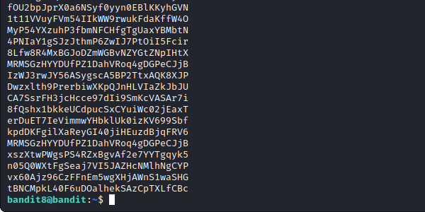<figcaption></figcaption></figure>

Sort - Used to sort a file, arranging the records in a particular order.

Uniq - Command-line utility that reports or filters out the repeated lines in a file.

Combining these commands to locate our flag in the text file, we use “sort data.txt | uniq –u", the “|” (pipe) included within our command allows us to glue 2 commands together. The “-u” flag within the uniq command will sort and remove any duplicate strings within the text file.

Upon entering this command, we are given the password to the next level!

<figure>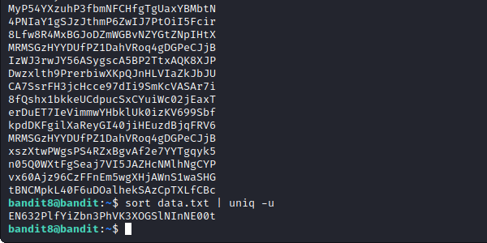<figcaption></figcaption></figure>

Password:

EN632PlfYiZbn3PhVK3XOGSlNInNE00t

## Bandit Level 9 → 10:

**Level Goal:** The password for the next level is stored in the file data.txt in one of the few human-readable strings, preceded by several ‘=’ characters.

Similar to the last level, level 9 asks us to locate the password among a few human-readable strings which is also preceded by several “=” characters. Again, concatenating the data file will get you nowhere.

<figure>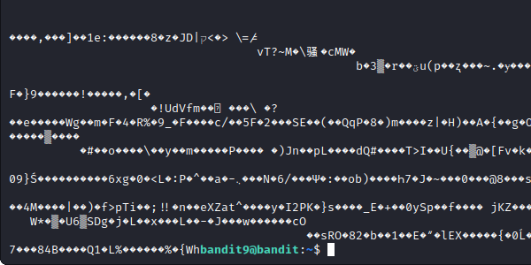<figcaption></figcaption></figure>

Like the last level, we will have to sort through the data.txt file. This time, we will utilize the strings command paired with the grep command. Your command should look similar to this, “strings data.txt | grep =”.

Upon entering the command, you are given the password for the next level.

<figure>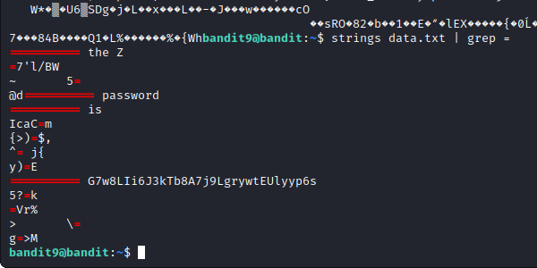<figcaption></figcaption></figure>

Password:

G7w8LIi6J3kTb8A7j9LgrywtEUlyyp6ss

